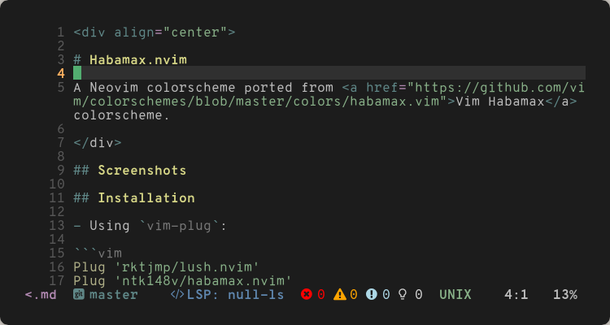
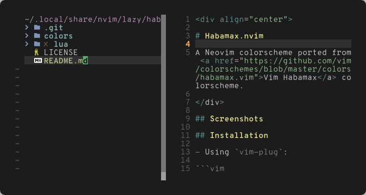
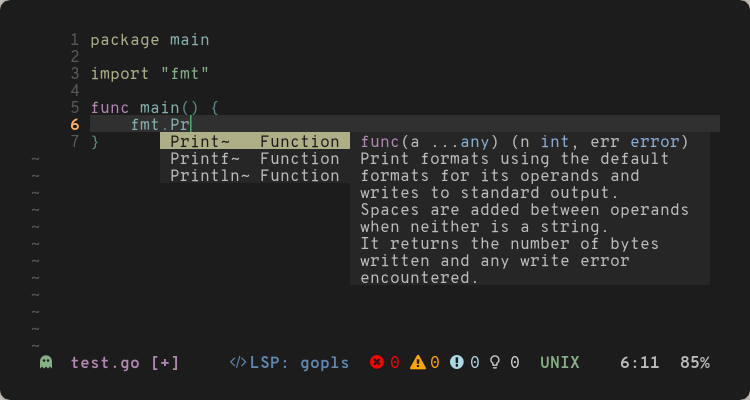
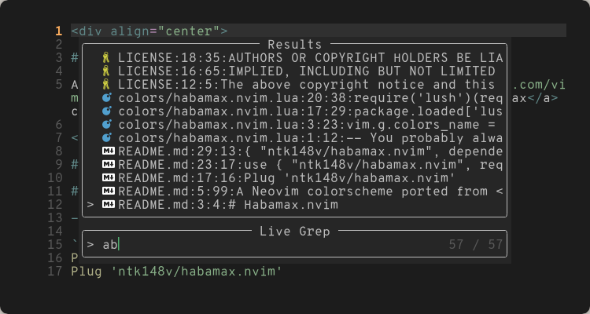

<div align="center">

# Habamax.nvim

A Neovim colorscheme ported from <a href="https://github.com/vim/colorschemes/blob/master/colors/habamax.vim">Vim Habamax</a> colorscheme.

</div>

## Screenshots

|                                                                           |                                                                           |
| ------------------------------------------------------------------------- | ------------------------------------------------------------------------- |
|  |  |
|  |  |

## Installation

- Using `vim-plug`:

```vim
Plug 'rktjmp/lush.nvim'
Plug 'ntk148v/habamax.nvim'
```

- Using `packer`:

```lua
use { "ntk148v/habamax.nvim", requires={ "rktjmp/lush.nvim" } }
```

- Using `lazy.nvim`:

```lua
{ "ntk148v/habamax.nvim", dependencies={ "rktjmp/lush.nvim" } }
```
